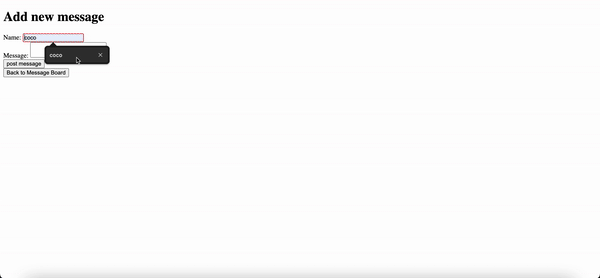

# mini-message-board

A simple message board built using Node.js, Express, and EJS, where users can post messages and view them in a list. It doesn't have any styling with css because it was done to practice backend.

---

🚀 Demo

 

---

📌 Features
- View messages on the homepage
- Submit new messages with a username and text
- Messages are timestamped
- View individual messages in detail pages

---

🛠️ Tech Stack
- Node.js
- Express.js
- EJS templating engine

---

💻 Run It Locally
- Clone the repository
  `git clone https://github.com/mlanda98/mini-message-board.git`
- Navigate into the project directory
  `cd mini-message-board`
- Install dependencies
  `npm install`
- configure environment variables in `.env` file:

```
PGUSER=your_postgres_username
PHOST=localhost
PGDATABASE=mini_message_board
PGPASSWORD=your_postgres_password
PGPORT=5432
NODE_ENV=development
```

- Start the server
  `npm start`
- Open your browser to `http://localhost:3000`

---

📂 Project Structure

```
mini-message-board/
├── views/
│ ├── index.ejs
│ ├── new.ejs
│ └── message.ejs
├── routes/
│ ├── index.js
│ ├── messages.js
│ └── newMessages.js
├── .env
├── index.js
└── package.json
```
---

🌱 Future Improvements
- Use a real database to store messages
- Add user login page
- Style the app with better UI/UX
- Add pagination

---

📬 Contact
- Email: mlandae16@gmail.com
